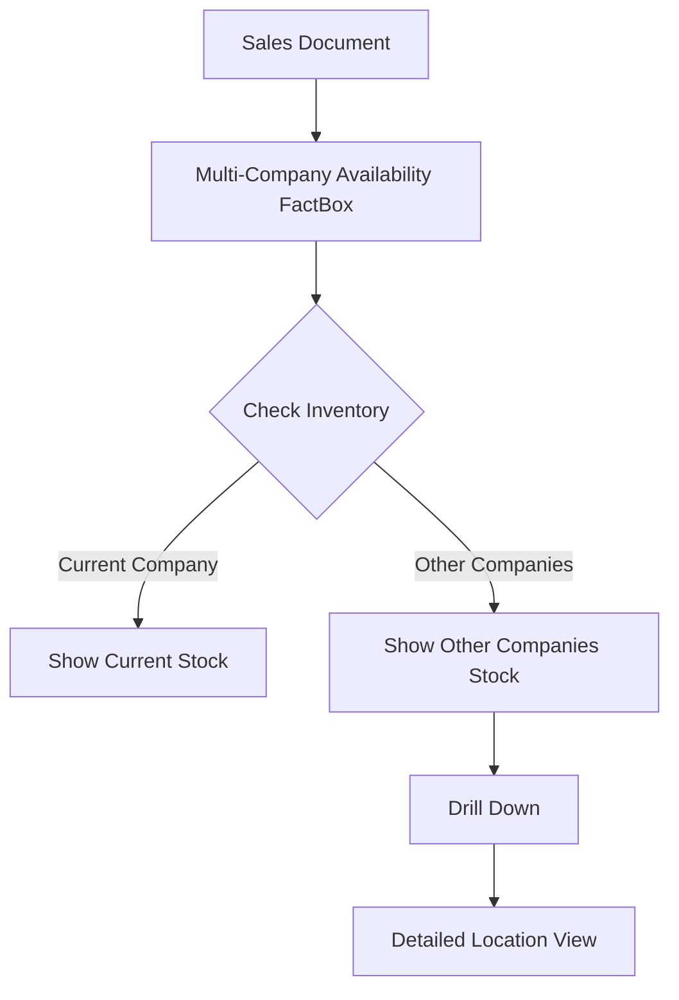
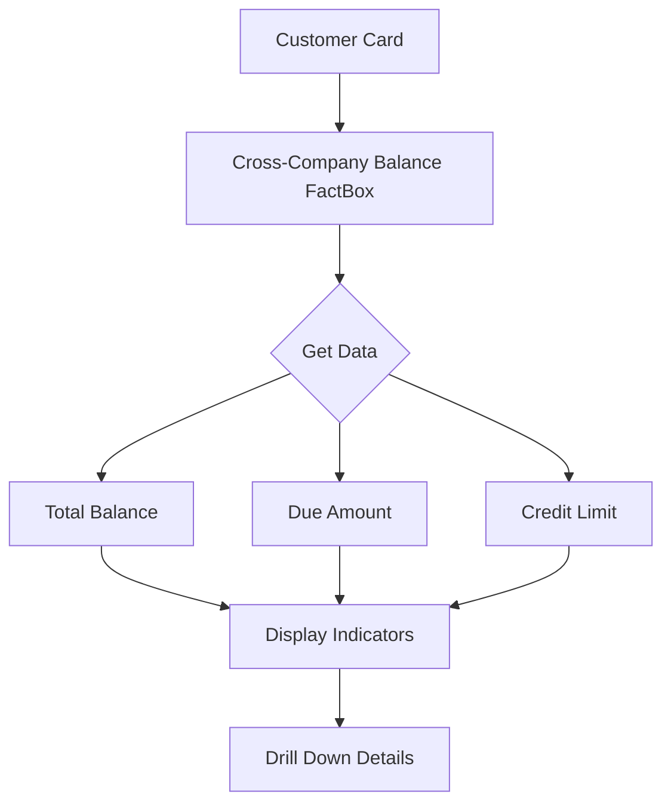
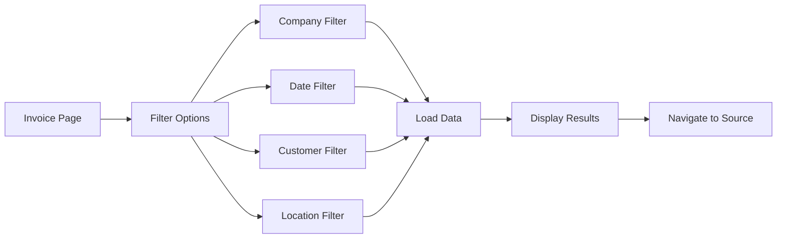
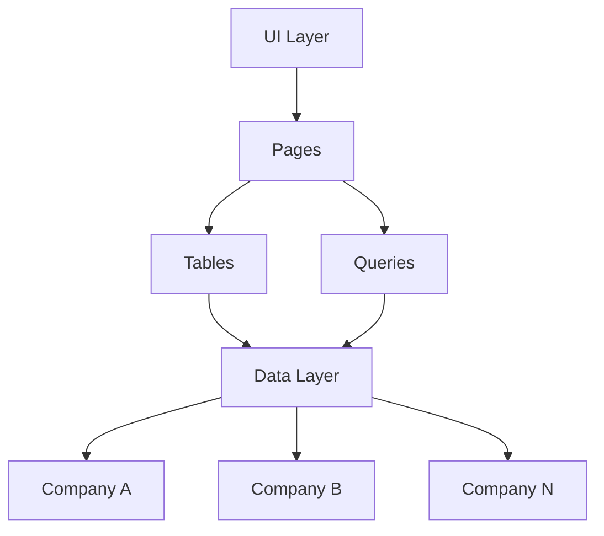

# Cross-Company Data Management Extension

This extension enables cross-company data visibility and management in Business Central, focusing on inventory availability, sales history, and customer balances across multiple companies.

## Features

### 1. Multi-Company Item Availability
- Real-time inventory levels across all companies
- Drill-down capability to detailed location-specific stock levels
- Integrated with sales documents for immediate availability checks

### 2. Cross-Company Sales History
- Consolidated view of sales across all companies
- Historical transaction analysis
- Location-based sales tracking

### 3. Cross-Company Customer Balances
- Unified customer balance overview
- Multi-company credit limit monitoring
- Overdue payment tracking

### 4. Combined Posted Sales Invoices
- Centralized view of all posted sales invoices
- Multi-company filtering capabilities
- Direct navigation to source documents

## Technical Architecture

## Installation

1. Import the extension to your Business Central environment
2. Verify permissions for cross-company access
3. Configure company access settings

## Usage

### Required Permissions
- SUPER or equivalent for cross-company operations
- Read permissions on source companies
- Write permissions for temporary tables

### Configuration
- Set up company access rights
- Configure location mappings if needed
- Set default filters as required

## Limitations

- Performance may vary based on number of companies
- Real-time data sync limitations
- Company-specific customizations may affect data consistency

## Support

For technical support or feature requests, please create an issue in the repository.

## License

This project is licensed under the MIT License - see the LICENSE file for details.
